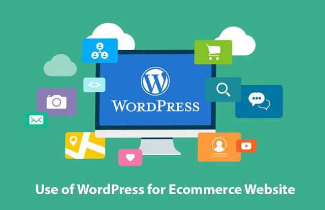

<h2 class='markdown__section'> Summary </h2>
  

    Build an E-Commerce Website using WordPress.  
  

<h2 class='markdown__section'> Course Overview </h2>
  

  Today, you can build a fantastic online store with no coding experience at all. All you need is a content development application called WordPress. WordPress is easy to learn and once you gain the knowledge required for this course building an online store is as easy as a few clicks. In this course, you’ll learn how to build an e-commerce website without any coding background.  
  
  
  This course is offered by BuniTek, where people of all skill levels are given the opportunity to learn how to use various digital technologies. 
  

<h2 class='markdown__section'> Are there any prerequisites? </h2>
  

  NOTE: It’d be worth noting that the only prerequisite to this course is the WordPress Basics course also offered by BuniTek. 
  
  In this course, you’ll find the steps necessary to build an online store using WordPress except the WordPress installation procedure. For that please refer to the WordPress Basics Course. Only after completing the WordPress Basics Course, can you proceed to learn how to construct an awesome and modern online store fully integrated with the latest payment options.  
  

<h2 class='markdown__section'> Course Delivery </h2>
  

  This course will be delivered by an instructor who will demonstrate each step of the store build. The students will follow along with their computer devices or observe for later implementation.   
  

<h2 class='markdown__section'>  What you will learn </h2>
  <ol>
    <li>Install and use WooCommerce to build e-commerce websites</li>
    <li>Install plugins and themes in WordPress</li>
    <li>Use WordPress and WordPress plugins to build a beautiful online store</li>
    <li>Learn how to integrate payment options on your store using PayPal, Stripe and other payment systems offered by WooCommerce</li>
  </ol>

  

 <a href="https://forms.gle/YshP2RryEUeqiXqH9" target="_blank"><button class="markdown__button is-primary has-bg-primary">BOOK THIS COURSE 

</button> </a>

