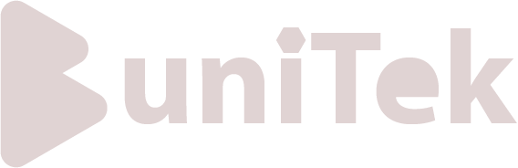

<h2 class='markdown__section'> Summary </h2>
  

  In this course, students will get an introduction to the world of programming. This beginner’s course gives bright young minds a head-start on one of the world’s most in-demand programming languages and the latest super-smart technology! Instagram. Spotify. Pinterest. All built on Python. 
  

<h2 class='markdown__section'> Course Highlights </h2>

  <h4 class="markdown__sub-section">Learn world-changing skills</h4>
    

      This beginner’s course gives bright young minds a head-start on one of the world’s most in-demand programming languages. 
    

  <h4 class="markdown__sub-section"> Who this course is for </h4>
    

      This is the perfect beginner's course for kids who have already worked on block coding and are ready to move into Python. Using micro:bits, students learn to bring code into the real world with lights, sounds and actions. 
    

  <h4 class="markdown__sub-section"> Fun learning environment </h4>
    

      Learn what code can do on screen and off. Let your new Python skills be the beginning of a world of problem-solving and creativity. Our code-long tutors will support you every step of the way.
    

<h2 class='markdown__section'> COURSE OVERVIEW </h2>
  

    On this course, students will be introduced to Python, the programming language that tech behemoths like Instagram, Pinterest and Spotify are all built on. Led by our code-loving instructors, kids and teens will be taught key programming concepts and how to apply them in exciting ways, from using Python to create video games to learning the relationship between software and hardware, discovering the role of Python in the multi-billion-dollar tech industry to learning the skills they need to build their own projects at home. Challenging, interactive and lots of fun, this course does more than just teach the fundamentals. It unlocks the world of programming for young people – and sparks the interest that makes them want to keep on exploring it. And, if they want to keep building their knowledge.
  

<h2 class='markdown__section'>  WHAT YOU WILL LEARN </h2>
  <ol>
    <li>Key programming concepts that can be applied to most coding languages</li>
    <li>How to use Python, an in-demand, syntax-based programming language, to create their own projects</li>
    <li>The relationship between software and hardware, using the micro:bit</li>
    <li>How sensors and outputs work – and how to use them and Python to make their computer speak to the outside world</li>
    <li>How to use Python to manipulate images and create 2D video games </li>
  </ol>

<a href="course/enRoll"><button class="markdown__button is-primary has-bg-primary">Register </button></a>

