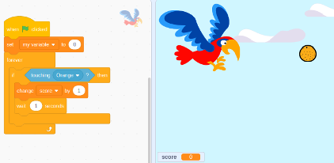
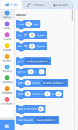

<h2 class='markdown__section'> Summary </h2>
  

    This course gives learners an introduction to programming in the most playful way while maintaining the goal of sparking their curiosity. Using block-based syntax to bring together logic, Scratch mildly but powerfully keeps students engaged in programming concepts while having fun working on their projects. 
  

  

<h2 class='markdown__section'> Course Highlights </h2>

  <h4 class="markdown__sub-section">To understand the concepts in block programming </h4>

  <h4 class="markdown__sub-section"> Use Scratch’s block programming to break down abstract and complex programming definitions to concrete and simpler definitions in every topic.  </h4>

  <h4 class="markdown__sub-section"> Apply programming concepts in building music, games and art projects </h4>

  <h4 class="markdown__sub-section"> To invoke creativity among students by adding exercises at the end of each lesson </h4>

<h2 class='markdown__section'> Who is this course for  </h2>
  

  Young learners from age 7 with an interest in programming, art or music can comfortably engage in the exercises. Any new programming learners or educators can also join in the fun
  

<h2 class='markdown__section'> What to expect   </h2>
  

  A very mild introduction to tough programming concepts using games and short projects. This is because the course is project based and will introduce the concepts briefly before moving to fun projects. 

  Students will learn to collaborate and share their projects after each session to encourage appreciation of creativity. 
  

<h2 class='markdown__section'> Timing</h2>
  

  This course is divided into short lessons that can be covered in 1:30 hours each or in the course of 2 hours, with a 30 minute break in between. 
  

<h2 class='markdown__section'> Course Overview </h2>
  

  Scratch allows students to explore their imagination to the fullest. Therefore after each lesson, take time to play with similar blocks and see the difference in how logic is interpreted by each.
  

  

  This curriculum is project based. Each project will highlight a new concept and the educator should have a good understanding of the basic concepts to students through them as they work on the project. 
  

<h2 class='markdown__section'>  What you will learn </h2>
  <ol>
    <li>An Introduction to block programming using Scratch</li>
    <li>Fun with motion while learning on motion and angles: Move my sprite </li>
    <li>Some fun with animation, an introduction to loops in programming</li>
    <li>Create a game while feeding a hungry parrot: Variables introduction </li>
  </ol>

 <a href="https://forms.gle/YshP2RryEUeqiXqH9" target="_blank"><button class="markdown__button is-primary has-bg-primary">BOOK THIS COURSE 

</button> </a>

