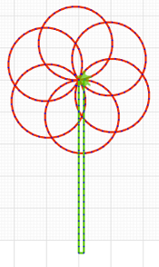

<h2 class='markdown__section'> Summary </h2>
  

    This course blends creativity in art and design with programming concepts. The course uses Snap! to introduce block-based programming and incorporates short projects that help students tweak their curiosity in coming up with unique designs.
    This is a great chance for students interested in embroidery to have fun digitally.
  

  
  
Coding your creativity away 

  <h4 class="markdown__sub-section"> Who this course is for </h4>
    

     Any learners interested in learning programming and/or design. Curious minds will blend in well with this course as it is not restricted to any format of programming and welcomes all forms of creativity.
    

<h2 class='markdown__section'> Course Overview </h2>
  

  Turtlestitch  is based on a browser-based educational programming language (Snap!) to generate patterns for embroidery machines.

TurtleStitch curriculum covers both concepts in drag-and-drop programming while incorporating the practical bit of stitching the designs created. 
Students will learn on different stitches and spend time brainstorming on the designs they will create even from the shortest of lessons with a single concept.
Mathematical concepts will be used to explain design patterns while programming concepts such as loops and functions will compress the math  and bring to life beautiful designs.

Educators are encouraged to introduce the concepts briefly and allow students use their own choice of patterns to achieve each project.

**The end goal is to have a canvas (like below) for all your class designs hence students should work to have different designs. It can be in hard copy, or soft copy canvas.

  

<h2 class='markdown__section'>  What you will learn </h2>
  <ol>
    <li>An introduction to block-based programming using Snap!</li>
    <li>A brief introduction to embroidery concepts, as well as stitching tips.</li>
    <li>Short projects teaching programming concepts and using that to code stitch designs. </li>
    <li>Lots of fun collaborating on projects and sharing the final designs online and/or with teams. </li>
  </ol>

 <a href="https://forms.gle/YshP2RryEUeqiXqH9" target="_blank"><button class="markdown__button is-primary has-bg-primary">Register Your Interest 

</button> </a>

